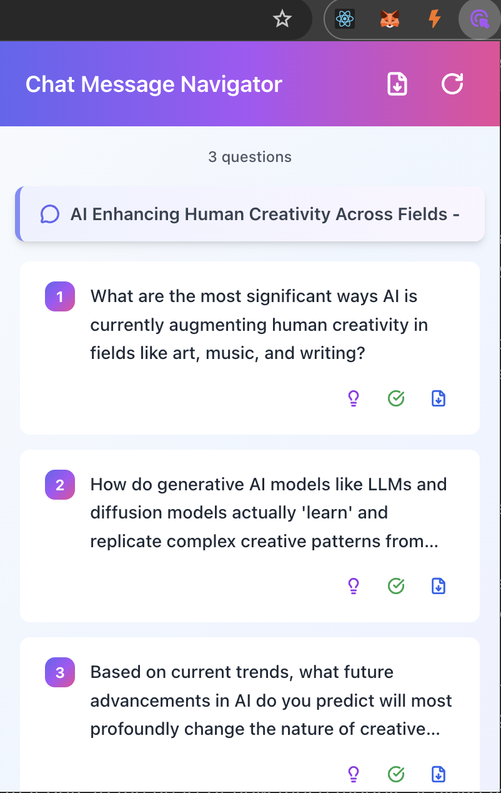

<div align="center">
  
  
  <h1>Chat Message Navigator</h1>
  
  <p>
    <a href="README.md">English</a> | 
    <a href="README_zh.md">中文</a>
  </p>
</div>

A Chrome extension for DeepSeek, ChatGPT, and Gemini chat pages that helps you quickly locate and navigate multiple questions within long conversations.

## Features

- 🔍 Automatically detects conversation turns (DeepSeek `data-um-id`, ChatGPT `<article>`, Gemini `<user-query>/<model-response>`)
- 📋 Lists every detected question in the popup
- 🎯 Jumps to a selected question or answer with one click
- 🔄 Keeps the list in sync with live page updates
- 💫 Provides smooth scrolling and highlight effects

## Tech Stack

- Vite + React + TypeScript
- TailwindCSS
- @crxjs/vite-plugin

## Development

### Install Dependencies

```bash
npm install
```

### Start Development Server

```bash
npm run dev
```

Vite keeps watching file changes and rebuilds automatically in development mode.

### Debugging Guide

1. **Start the dev server**
   ```bash
   npm run dev
   ```
   Vite recompiles automatically whenever you edit the code.

2. **Load the extension in Chrome**
   - Open `chrome://extensions/`
   - Toggle on “Developer mode” in the top-right corner
   - Click “Load unpacked”
   - Select the `dist` directory (not the project root)

3. **Debug different parts**

   **Popup debugging** – three options:
   
   **Option 1: Inspect directly (recommended)**
   - Open the extension popup from the toolbar
   - Right-click inside the popup and choose “Inspect”
   - Chrome opens a dedicated DevTools window for the popup
   
   **Option 2: From the extensions page**
   - Visit `chrome://extensions/`
   - Find your extension under “Inspect views”
   - Click “popup.html” / “Inspect popup” (available after you open the popup once)
   
   **Option 3: Keep the popup persistent**
   - Open the popup, then press `F12` to bring up DevTools
   - Run `chrome.action.setPopup({ popup: '' })` in the Console
   - The popup launches in a new tab, making debugging easier
   - Refresh the extension afterward to restore normal popup behavior
   
   **Tips**
   - Access React components directly if React DevTools is installed
   - Set breakpoints under the Sources tab
   - Refresh the popup to see code changes (close and reopen if necessary)
   - Use `console.log()` whenever helpful

   **Content script debugging**
   - Open a chat page: DeepSeek (`https://chat.deepseek.com`), ChatGPT (`https://chat.openai.com` / `https://chatgpt.com`), or Gemini (`https://gemini.google.com`)
   - Press `F12` to open DevTools
   - Inspect logs in the Console tab
   - Locate bundled source code under `chrome-extension://[EXTENSION_ID]/src/content/`

   **Background script debugging**
   - Go to `chrome://extensions/`
  - Click “service worker” under “Inspect views” for this extension
   - A dedicated DevTools window opens for the service worker

4. **Hot Module Replacement (HMR)**
   - Vite rebuilds automatically on file changes
   - Refresh the extension from `chrome://extensions/` (click the refresh icon on the extension card)
   - Popup and content scripts usually update after a page refresh

5. **Check logs**
   - Popup logs: DevTools Console of the popup
   - Content script logs: Console of the target chat page
   - Background logs: service worker DevTools Console

### Build

```bash
npm run build
```

Bundled output is generated in the `dist` directory.

## Installation

1. Build the project: `npm run build`
2. Open `chrome://extensions/`
3. Enable “Developer mode”
4. Click “Load unpacked”
5. Select the `dist` directory

## Usage

1. Visit any supported chat page—DeepSeek, ChatGPT, or Gemini
2. Click the extension icon in the browser toolbar
3. Review the detected questions in the popup
4. Select any question to jump to its position on the page instantly

### Screenshot

<div align="center">
  
</div>

## Notes

- Works only on supported chat domains (DeepSeek, ChatGPT, Gemini)
- Detection relies on page-specific structures (`data-um-id`, `<article>`, `<user-query>/<model-response>`)
- The extension observes DOM mutations and updates the popup list automatically

